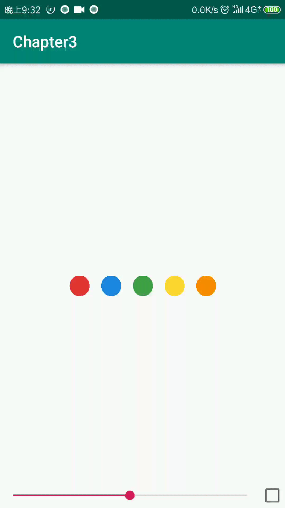
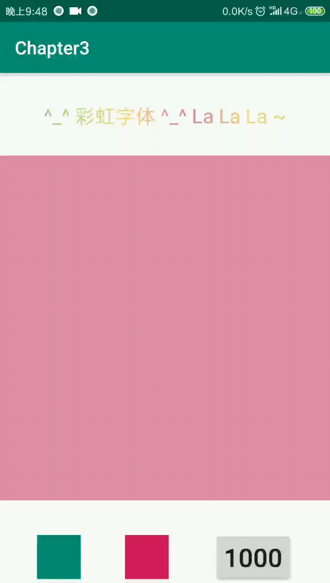

# Chapter3
Day 03: homwork of ByteDance Android training in BIT

## 作业完成情况记录

### chapter3 exercise1

* 添加Lottie Android库依赖，版本2.7.0。
```gradle
 implementation "com.airbnb.android:lottie:2.7.0"
```
> https://airbnb.io/lottie/android/android.html

* 在layout文件中添加LottieAnimationView控件，用于动画效果显示。
```xml
<com.airbnb.lottie.LottieAnimationView
        android:id="@+id/animation_view"
        android:layout_width="wrap_content"
        android:layout_height="wrap_content"
        android:layout_gravity="center"
        app:lottie_autoPlay="false"
        app:lottie_loop="true"
        app:lottie_rawRes="@raw/material_wave_loading"
        app:lottie_repeatMode="restart" />
```

> https://airbnb.io/lottie/android/android.html#from-xml

* 在拖动SeekBar触发onProgressChanged事件时，相应地改变动画的进度。
```java
animationView.setProgress(progress / 100.0f);
```

> https://airbnb.io/lottie/android/android.html#custom-animators

注：修改了`animationView.resumeAnimation();`方法恢复动画，让通过seekBar修改动画进度后动画显示效果更连贯。

**exercise1的动画效果如下gif所示：**

<p align="center">
    
    <p align="center">
        <em>exercise1 demo</em>
    </p>
</p>

### chapter3 exercise2

* 修改控件可见属性，使rainbow特效文字可见。
```
android:visibility="visible"
```

* 实现另一个 ObjectAnimator，对 target 控件的大小进行缩放，从 1 到 2 循环
```java
        //横向缩放
        ObjectAnimator animator2 = ObjectAnimator.ofFloat(target, "scaleX", 1, 2);
        animator2.setDuration(Integer.parseInt(durationSelector.getText().toString()));
        animator2.setRepeatCount(ObjectAnimator.INFINITE);
        animator2.setRepeatMode(ObjectAnimator.REVERSE);

        //纵向缩放
        ObjectAnimator animator3 = ObjectAnimator.ofFloat(target, "scaleY", 1, 2);
        animator3.setDuration(Integer.parseInt(durationSelector.getText().toString()));
        animator3.setRepeatCount(ObjectAnimator.INFINITE);
        animator3.setRepeatMode(ObjectAnimator.REVERSE);
```
* 在这里实现另一个 ObjectAnimator，对 target 控件的透明度进行修改，从 1 到 0.5f 循环
```java
        ObjectAnimator animator4 = ObjectAnimator.ofFloat(target, "alpha", 1.f, 0.5f);
        animator4.setDuration(Integer.parseInt(durationSelector.getText().toString()));
        animator4.setRepeatCount(ObjectAnimator.INFINITE);
        animator4.setRepeatMode(ObjectAnimator.REVERSE);
```
* 将上面创建的其他 ObjectAnimator 都添加到 AnimatorSet 中
```java
        animatorSet = new AnimatorSet();
        animatorSet.playTogether(animator1, animator2, animator3, animator4);
        animatorSet.start();
```


**exercise2的动画效果如下gif所示：**

<p align="center">
    
    <p align="center">
        <em>exercise2 demo</em>
    </p>
</p>


### 扩展部分 Extension

* 模仿LottieSample中的例子，修改exercie1的中demo。

功能点： 添加动画播放按钮；添加动画循环设置按钮；按钮额外加了一些小状态的变化交互，按钮实际上是CheckBox

> 该部分代码实现查看test分支

**动画效果如下gif所示：**

<p align="center">
    
    <p align="center">
        <em>Sample demo</em>
    </p>
</p>